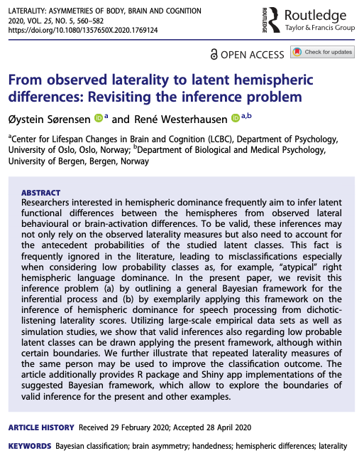
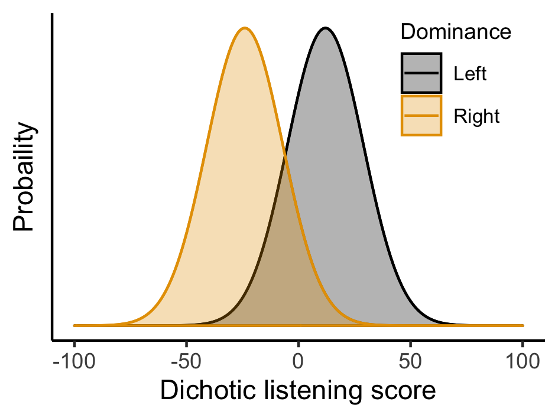
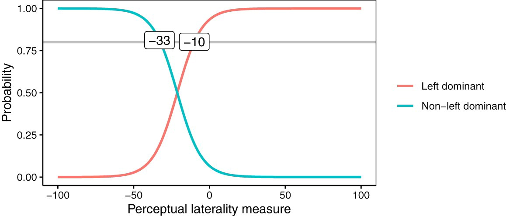
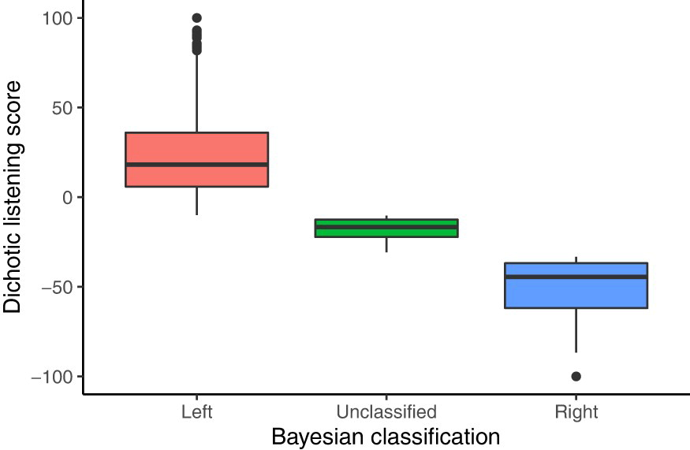
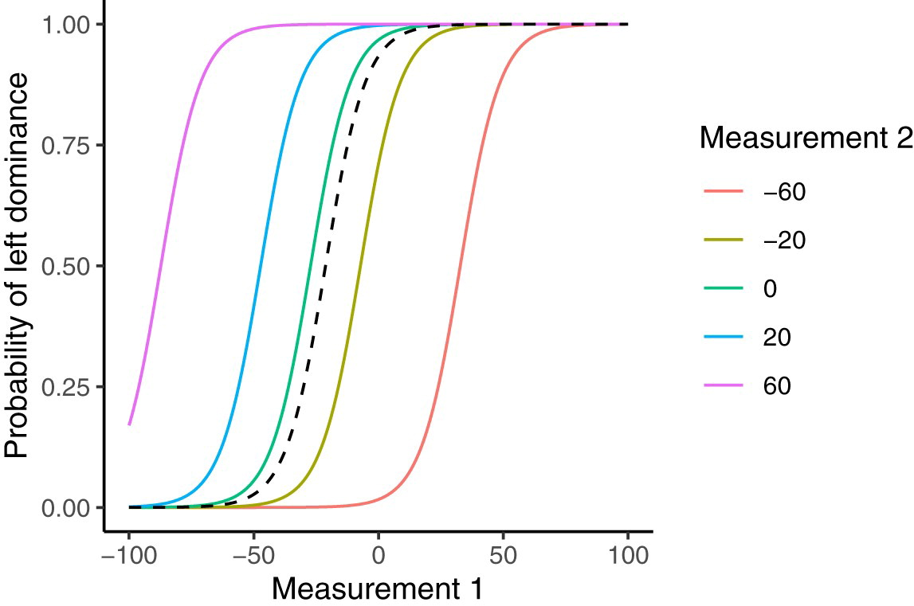
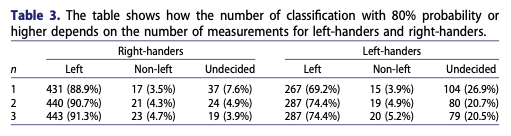
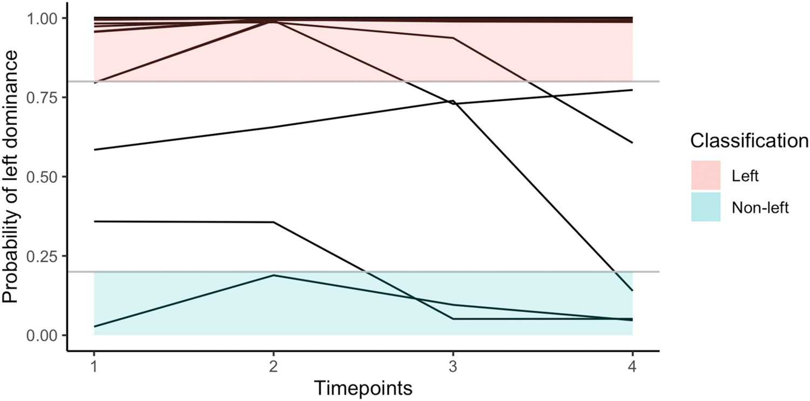
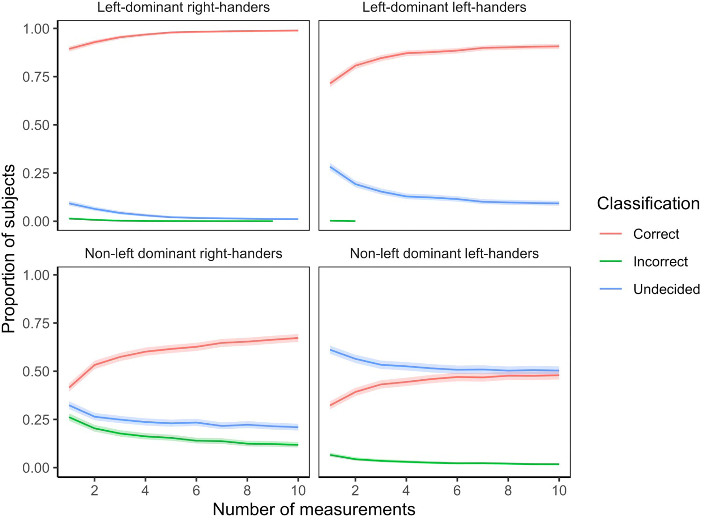
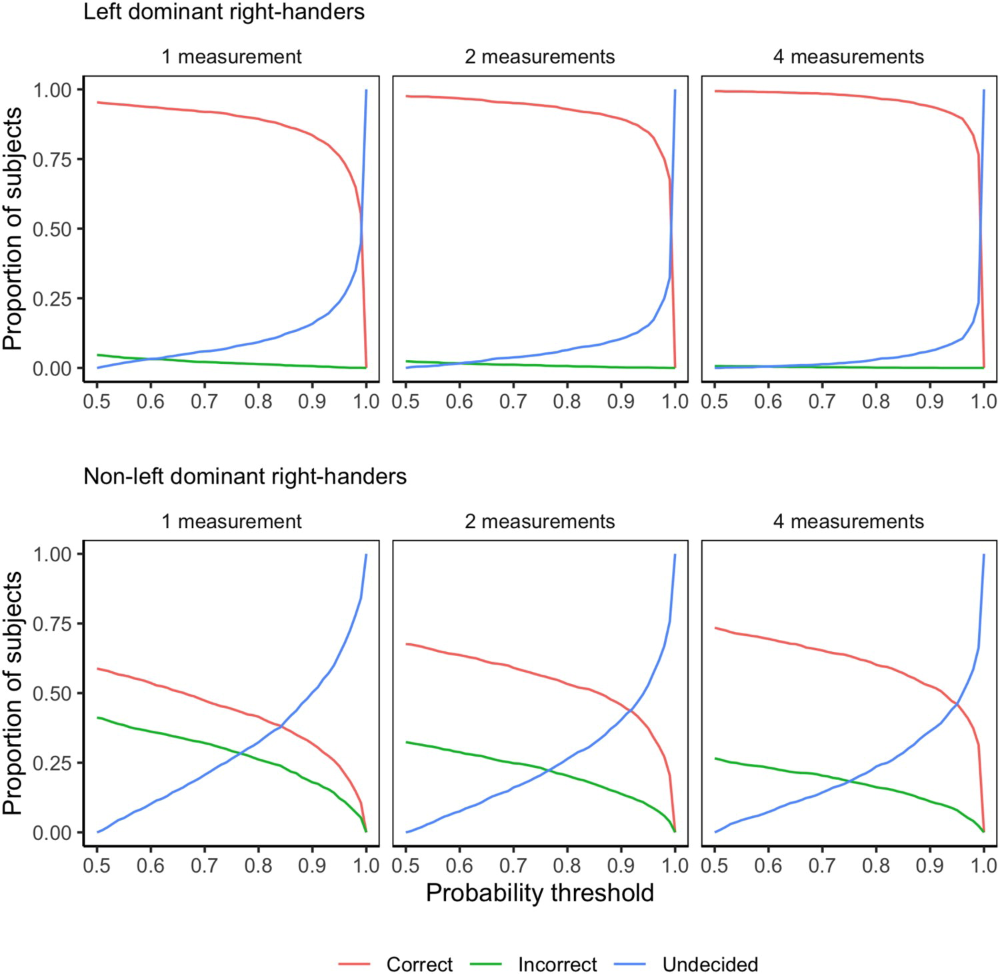
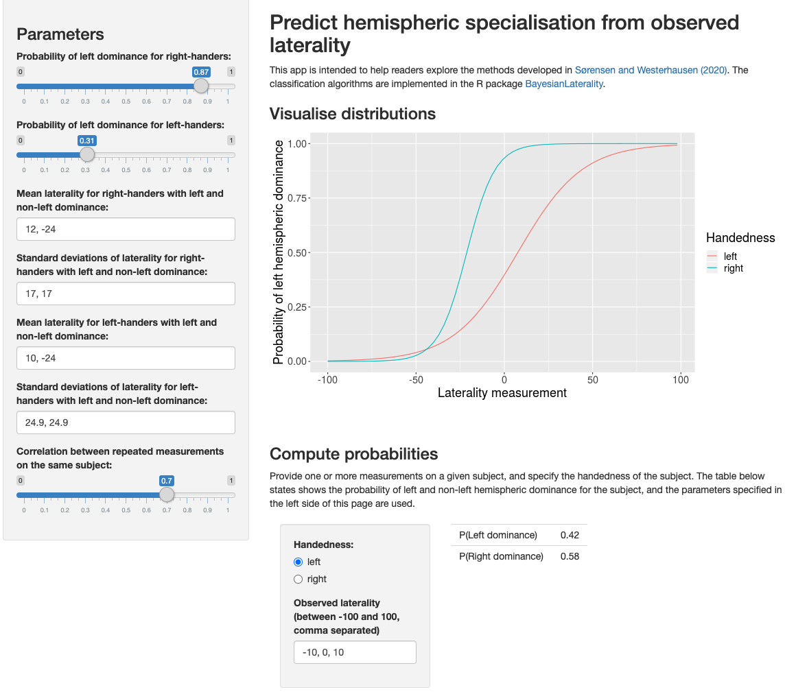

layout: true
    
<div class="my-sidebar"></div> 

---
class: middle, center


```{r setup, include=FALSE}
# Here you can place global options for the entire document.
# Mostly used for knitr settings, but can also load data etc.
# Whatever happens here will not show in the presentation.
knitr::opts_chunk$set(echo = TRUE)
library(tidyverse)
```



---

# Background

- How to determine which hemisphere is dominant for a given task, based on indirect measurements?

- Example 

  - Measurement: Right/left ear advantage in dichotic listening
  
  - Inference: Left/right dominance for language processing
  
--

- Problem: Most people are left dominant.

- Satz (1977) showed, based on then available data from sodium-amytal tests:

  - Seeing that a person has a left-ear advantage increases the probability that the person is right dominant from 0.05 to 0.10.
  
  - Seeing a right-ear advantage increases the probability of left dominance from 0.95 to 0.97.


<small>
Satz, P. (1977). Laterality Tests: An Inferential Problem. Cortex, 13(2), 208–212. https://doi.org/10.1016/S0010-9452(77)80010-5
</small>

---

# Background

- Question: Do Satz' conclusions still hold, our can we do something better?

- Some opportunities:

  - Dichotic listening experiments given a continuous index, e.g. between -100 and 100, rather than simply left/right.

  - Can repeated measurements of the same subject give more reliable conclusions?

  - New data are available, so the probabilities of left and right dominance in the population should be updated.
  
  - Handedness is an additional source of information.


---
class: inverse, middle, center

# A model for inferring hemispheric dominance

---

# Component 1: Prior probability

- Let $p(\alpha)$ denote the probability that a given person in the population has hemispheric dominance $\alpha$.

- In Carey and Johnstone (2014), we find, for right-handers:

  - Probability of left dominance for language processing is $p(\alpha = \text{left}) = 0.87$
  
  - Accordingly, $p(\alpha = \text{non-left}) = 0.13$
  
- Our goal is to infer the value of $\alpha$ based on something which is more easy to measure.

<small>
Carey, D. P., & Johnstone, L. T. (2014). Quantifying cerebral asymmetries for language in dextrals and adextrals with random-effects meta analysis. Frontiers in Psychology, 5. https://doi.org/10.3389/fpsyg.2014.01128
</small>

---

# Component 2: Conditional probability

.pull-left[
- Let $p(x|\alpha)$ denote the conditional probability of observing a dichotic listening score $x$ for a person with hemispheric dominance $\alpha$.

- In van der Haegen et al. (2013) we find:

  - With left dominance, mean of $x$ is 12, with standard deviation 17.
  
  - With right dominance, mean of $x$ is -24.

- Classical test theory: Assume measurements $x$ are normally distributed around the mean for each group.

]
.pull-right[
```{r, include=FALSE, eval=FALSE}
crossing(
  x = seq(from = -100, to = 100, by = 1),
  dominance = c("Left", "Right")
) %>% 
  mutate(
    mu = if_else(dominance == "Left", 12, -24),
    pdf = dnorm(x, mean = mu, sd = 17)
  ) %>% 
  ggplot(aes(x = x, y = pdf, group = dominance, color = dominance)) + 
  geom_line() +
  theme_bw() +
  theme(
    panel.grid = element_blank(),
    panel.border = element_blank(),
    axis.line = element_line(),
    legend.position = c(.82, .8),
    legend.text = element_text(size = 8),
    legend.title = element_text(size = 9)
  ) +
  scale_y_continuous(labels = scales::percent_format()) +
  xlab("Dichotic listening score") +
  ylab("Probaility") + 
  labs(color = "Dominance")  +
  ggthemes::scale_color_colorblind()

ggsave("figures/normal_dist.png", width = 8, height = 6, units = "cm")
```


]

<small>
Van der Haegen, L., Westerhausen, R., Hugdahl, K., & Brysbaert, M. (2013). Speech dominance is a better predictor of functional brain asymmetry than handedness: A combined fMRI word generation and behavioral dichotic listening study. Neuropsychologia, 51(1), 91–97. https://doi.org/10.1016/j.neuropsychologia.2012.11.002
</small>

---

# Component 3: Posterior probability

- Bayes' theorem gives us a way to compute the probability of hemispheric dominance $\alpha$ given a prior distribution $p(\alpha)$ and a condition probability $p(x|\alpha)$.

$$p(\alpha | x) = \frac{p(x | \alpha) p(\alpha)}{p(x | \alpha = \text{left}) p(\alpha = \text{left}) + p(x | \alpha = \text{non-left}) p(\alpha = \text{non-left})}$$

- To summarize:

  - $p(\alpha)$ is the proportion of left and non-left dominant individuals in the population.
  
  - $p(x|\alpha)$ is the probability of observing a measurement $x$ for an individual with dominance $\alpha$.
  
  - $p(\alpha |x )$ is the probability of dominance $\alpha$ for an individual with observation $x$.
  
---
class: inverse, middle, center

# Some examples


---

# Probability of left or non-left dominance

- A single measurement $x$ between -100 and 100, where negative numbers imply left-ear advantage and positive numbers imply right-ear advantage. Right-handers only.

  - Already at a measure of -10, the probability of left dominance exceeds 80%.
  
  - Probability of right dominance exceeds 80% at -33 or below.

<center>

</center>

---

# How certain are we?

- 2,855 dichotic listening measurements of right-handers, obtained with the iDichotic App. 

- Rule: If probability of left/right is at least 80%, then classify. Otherwise leave unclassified.

  - 2517 classified as left dominant, 105 as right dominant, and 233 unclassified.
  

<center>

</center>

---
class: inverse, middle, center

# Multiple measurements

---

# Multiple measurements

- We expect two measurements of the same individual to be more correlated than two measurements of different individuals.

- Define 

  - $\sigma_{b}^{2}$, variance between individuals
  
  - $\sigma_{w}^{2}$, variance within individuals
  

- This intraclass correlation can be estimated from the data at hand

$$r = \frac{\sigma_{b}^{2}}{\sigma_{w}^{2} + \sigma_{b}^{2}}$$

  
- With an extension of the formula for posterior probability of hemispheric dominance, we can use this information.

---

# Multiple measurements

.pull-left[
- First measurement shown along the horizontal axis.

- Second measurement indicated by color code.

- Dashed line shows the reference probability for a single measurement.

- Essentially, two measurements pointing in the same direction makes us more certain.
  
]
.pull-right[

]

---

# Multiple measurements

- Data from Karlsson et al. (2019): 871 participants, each with three perceptual laterality measures.

- The table shows the effect of using only the first measurement ($n=1$), the first and second ($n=2$), and all ($n=3$).

<center>

</center>

<small>
Karlsson, E. M., Johnstone, L. T., & Carey, D. P. (2019). The depth and breadth of multiple perceptual asymmetries in right handers and non-right handers. Laterality, 24(6), 707–739. https://doi.org/10.1080/1357650X.2019.1652308
</small>

---

# Multiple measurements

- Data from Bless et al. (2013), with four measurements per participant.

- Each line represents a person, and shows how the classification is adjusted when more timepoints are added.

<center>

</center>

<small>
Bless, J. J., Westerhausen, R., Arciuli, J., Kompus, K., Gudmundsen, M., & Hugdahl, K. (2013). “Right on all Occasions?” – On the Feasibility of Laterality Research Using a Smartphone Dichotic Listening Application. Frontiers in Psychology, 4. https://doi.org/10.3389/fpsyg.2013.00042
</small>

---
class: inverse, middle, center

# Simulation experiments

---
# Simulation experiments

- We simulated data with a known truth, and investigated how well we were able to classify the individuals.

<center>

</center>


---
# Classification threshold

- We have used an 80% threshold for classification, meaning that if the probability of left hemispheric dominance is between 20% and 80%, we say "Undecided". 

- Note that this threshold applies to the last classified individual. The average probability among the classified is typically around 95%.

- The choice of 80% is essentially arbitrary, and depends on the trade-off between:

  - How bad is it to make a mistake?
  
  - How bad is it to leave someone unclassified?
  
- Some additional simulation results illustrate this.


---
# Classification threshold

<center>

</center>


---
class: inverse, middle, center

# Some comments


---

# Parameters

- The model depends on independent data estimating:

  1. The prevalence of a given hemispheric dominance $\alpha$ in the population: $p(\alpha)$.
  
  2. The mean and standard deviation of measurement $x$ for people in each group defined by $\alpha$: $p(x|\alpha)$.
  
- Given this, the machinery works, and produces the probability of hemispheric dominance given data: $p(\alpha|x)$.

- Extensions to multiple classes, e.g., left dominant, bilateral, right dominant, is in principle straightforward, but requires parameter estimates. We show this in Appendix 2.

- Using multiple measurement paradigms is also possible, and we show this in Appendix 3. Again, the problem is points 1 and 2 above.

---

# App

https://osorensen.shinyapps.io/BayesianLateralityApp/

<center>

</center>
  
---

# R Package

```{r, eval=FALSE}
install.packages("BayesianLaterality")
```

```{r}
library("BayesianLaterality")

```

---
# R Package

<small>

```{r}
example_data1
predict_dominance(example_data1)
```

</small>

---
class: inverse, middle, center

# Thank you!

Questions/comments?